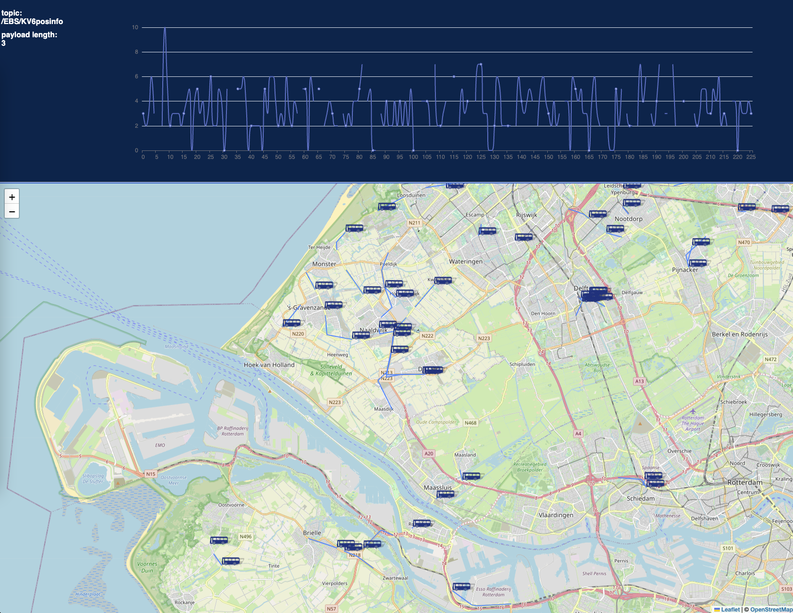

# Tubestar.js

Show data from Open APIs for Dutch public transport.

Data source: https://data.ndovloket.nl/REALTIME.TXT

Stack: Express, Server Side Events, Zero MQ bindings.

[Converts](./src/main/rd2wgs.ts) RD (Rijksdriehoek) to WGS 84 (Latitude & Longitude coordinates)

## TODO

- prevent the blinking of markers on each update
- use fp-ts / RxJS observable
